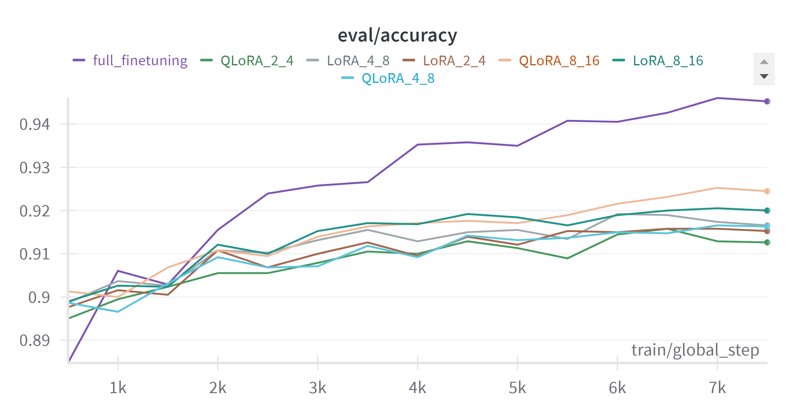
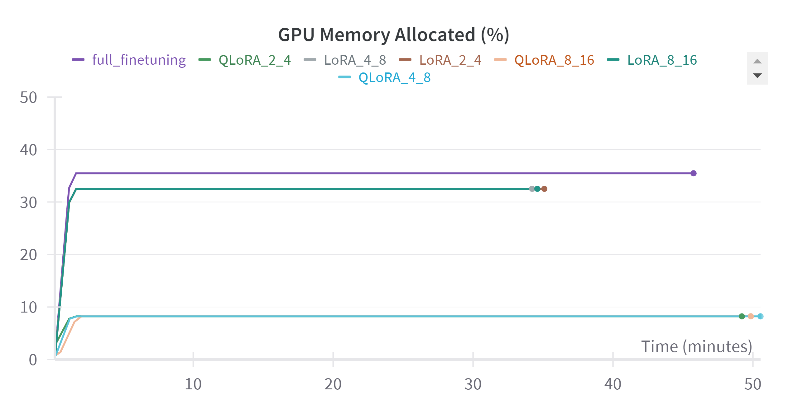
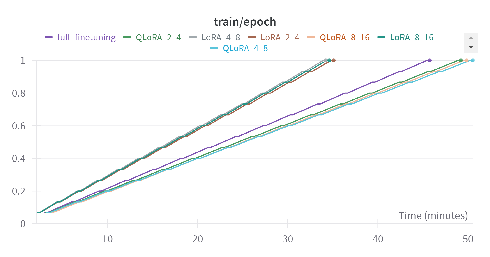

# To Quantize Or Not To Quantize
<!-- Mini Project developed for Deep Learning course at NYU (Spring 24) -->
Project to study tradeoffs between LoRA and QLoRA finetuning.

This project explores the memory and computational trade-offs between LoRA and QLoRA techinques in fine-tuning large language models (LLMs) for specific tasks. LoRA aims to reduce the trainable parameter space of LLMs while maintaining performance, making fine-tuning more efficient in resource-constrained environments. QLoRA is a method for efficiently fine-tuning LLMs by reducing memory usage while preserving full 16-bit fine-tuning task performance.

Through empirical evaluations on classification tasks, we assess the trade-offs between both of these approaches. This project hopes to explore scalable and resource-efficient natural language processing systems, thus contributing to democratization of LLM research.

## Project Milestones
- [x] Selecting the model for fine-tuning - RoBERTa
- [x] Selecting the task on which to fine-tune the model - Sequence Classification
- [x] Selecting a dataset with which to fine-tune for the task - [ag_news](https://huggingface.co/datasets/ag_news)
- [x] Writing code to set up fine-tuning pipelines for LoRA and QLoRA
- [x] Performing evaluations
- [x] Examining the effect of LoRA rank and alpha value on performance

## Code Structure
Run the first cell to install required huggingface libraries for setting up pipeline for finetuning and to install nvidia library to monitor GPU usage.
For LoRA and QLoRA finetuning use **LoRA_and_QLoRA.ipynb** notebook. Following variables can then be modified to configure the fine-tuning run as needed:
- lora_r
- lora_alpha
- use_QLoRA

At third cell provide api key for Weights and Biases login.

For full-finetuning use **full_finetune.ipynb** notebook.

Executed notebooks for few configurations are in folder **executed_runs**  they have outputs for previous runs.

## Results

| Method           | Rank-Alpha | Eval Accuracy | GPU Memory Used (MB) | Training Time (sec) |
|------------------|------------|---------------|----------------------|---------------------|
| QLoRA            | 2-4        | 92.0789       | 2692                 | 2944.13             |
| LoRA             | 2-4        | 92.2632       | 10652                | 2096.62             |
| QLoRA            | 4-8        | 92.2632       | 2694                 | 3021.55             |
| LoRA             | 4-8        | 92.7368       | 10654                | 2044.91             |
| QLoRA            | 8-16       | 92.5526       | 2696                 | 2960.02             |
| LoRA             | 8-16       | 93.0789       | 10656                | 2066.59             |
| Full-Finetuning  | -          | 94.4737       | 11622                | 2737.17             |

Link to [weights and biases view](https://wandb.ai/hpml99/lora_and_qlora_v2?nw=9j1e9s74b5b) for more graphs.

## Observations

- For very small drop in accuracy, QLoRA decreases the memory requirement of GPU significantly (less than 1/3rd GPU memory required) as compared to LoRA.
- Fine-tuning using QLoRA takes more time compared to LoRA and Full-finetuning because of additional calculations involved for quantization.
- Evaluation time was shortest for Full-finetuning, but that may be because adapter weights were not merged with pretrained weights for LoRA and QLoRA during training.

## References

- [LoRA](https://github.com/microsoft/LoRA)
- [QLoRA](https://github.com/artidoro/qlora)
- [Hugging Face](https://huggingface.co/docs/transformers/en/training)
- [bitsandbytes](https://colab.research.google.com/drive/1VoYNfYDKcKRQRor98Zbf2-9VQTtGJ24k?usp=sharing)
- [PEFT example](https://github.com/achimoraites/machine-learning-playground/blob/main/NLP/Text%20classification/Lightweight_RoBERTa_PEFT_LORA_FineTuning.ipynb)
- [Practical Tips for Finetuning LLMs Using LoRA](https://magazine.sebastianraschka.com/p/practical-tips-for-finetuning-llms)

